<table>
  <tr>
    <th colspan="2">
      <h1 align="center">Hi 👋, I'm Ahmad Alhallaq</h1>
      <h3 align="center">Backend Developer | Java | Spring Boot | Building scalable systems & secure applications</h3>
    </th>
  </tr>
  <tr>
    <td colspan="2" align="left">
      <ul>
        <li>💼 I’m currently working on <a href="https://github.com/AhmadAlHallaq131/HR-System">HR Multi-Tenant System</a></li>
        <li>🤝 I’m looking to collaborate on <a href="https://github.com/AhmadAlHallaq131/Chatbot">Backend systems, Spring Boot projects, AI chatbots</a></li>
        <li>📫 How to reach me: <strong>ahmadalhallaq131@gmail.com</strong></li>
      </ul>
    </td>
  </tr>
  <tr>
    <th width="30%">Connect with me</th>
    <td>
      
      
      
    </td>
  </tr>
  <tr>
    <th>Languages & Tools</th>
    <td>
      
      
      
      
      
      
      
      
      
      
        
      
      
      
      
      
      
    </td>
  </tr>
  <tr>
    <th rowspan="2">GitHub Metrics & Live Stats</th>
    <td align="center">
      
    </td>
  </tr>
  <tr>
    <td align="center">
      
      
    </td>
  </tr>
</table>
